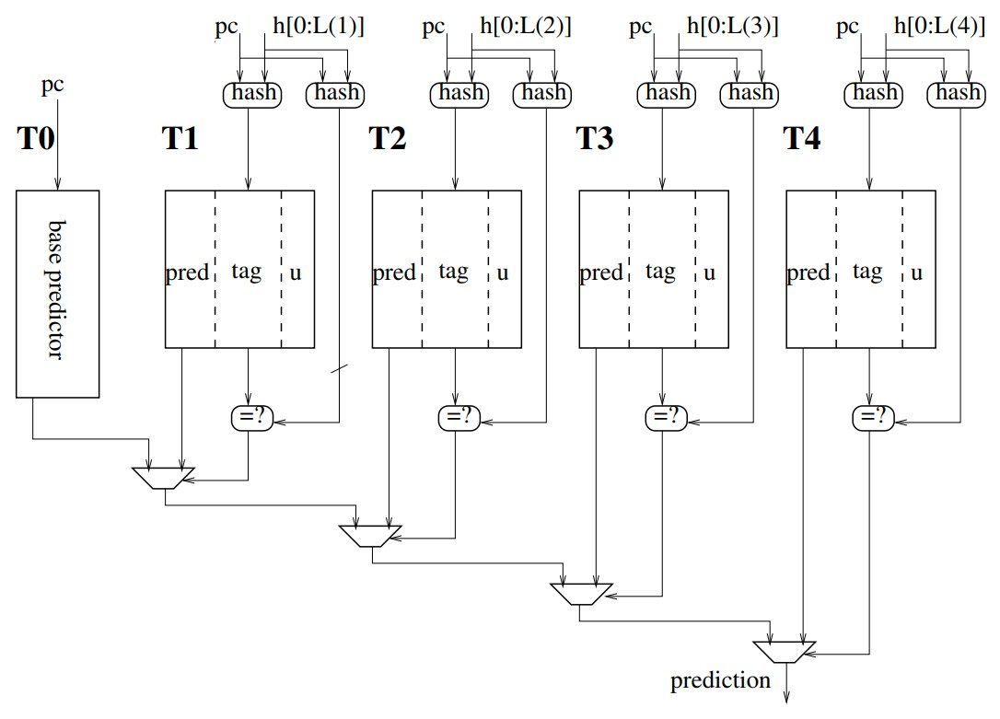
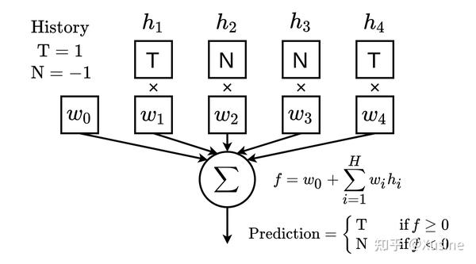
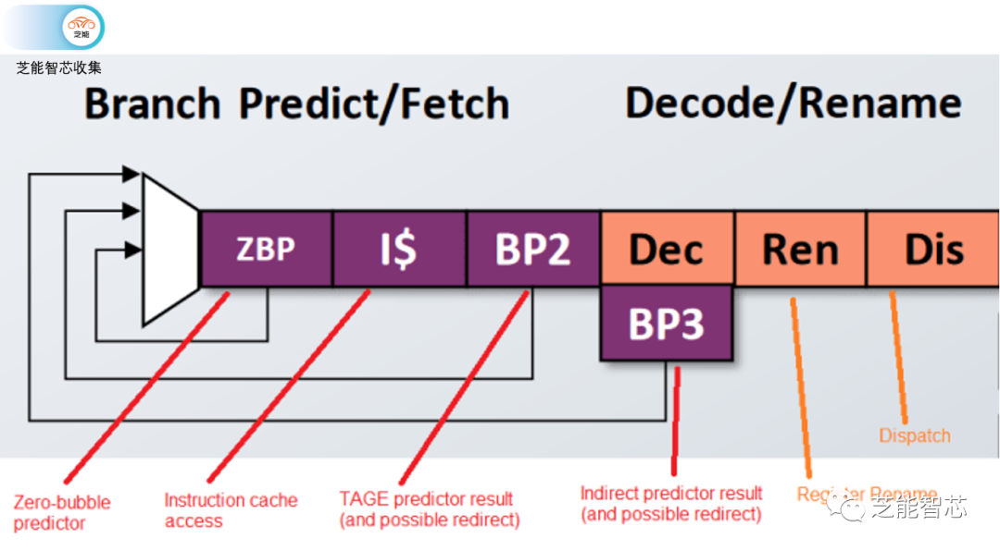
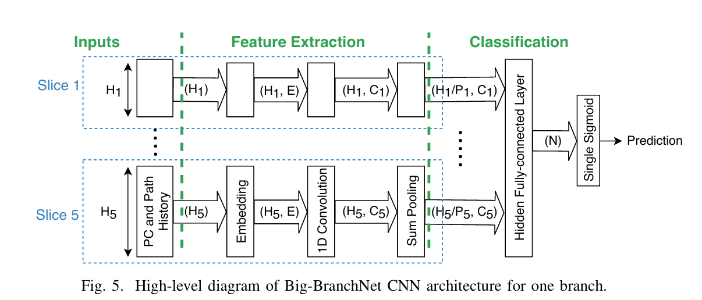
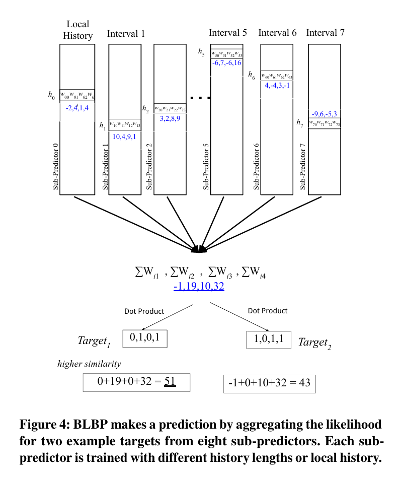
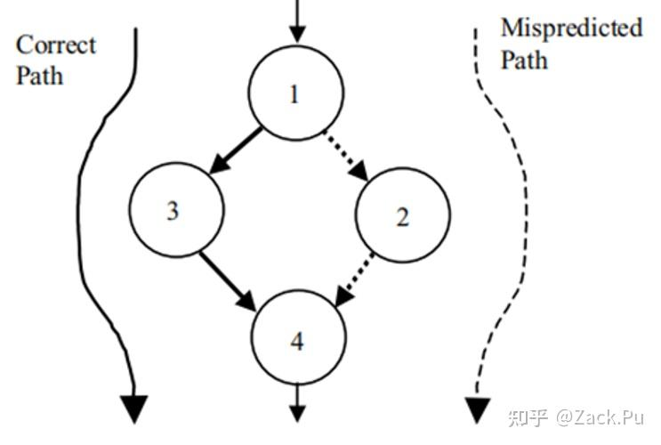

# 读书报告 / Reading Report

## 分支预测技术综述

## A Survey of Branch Prediction Techniques

**作者**: 刘宇轩

**班级**: 23R0313

**提交日期**: 2025年11月30日

---

## 中文摘要

高性能微处理器依赖于高水平的指令供给，而分支预测在过去近30年中一直是关键的性能影响因素。目前分支预测使用的分支预测器主要基于两种结构：TAGE预测器与perceptron-based预测器。而近年来的技术也主要在这两方面发展，本文将重点围绕这两个技术进行探讨。

关键词：分支预测；处理器体系结构；性能优化；机器学习

---

## English Abstract

(Write the English abstract here, about 150–300 words.)

High-performance microprocessors rely on a high level of instruction supply, and branch prediction has been a critical performance factor for nearly three decades. The branch predictors currently employed primarily rely on two architectures: TAGE predictors and perceptron-based predictors. Recent technological advancements have also focused on these two areas. This paper will concentrate on exploring these two technologies.

Keywords: branch prediction; processor architecture; performance optimization；machine learning

---

## 1. 引言 / Introduction

在开篇前，首先要简单介绍一下两种基础的分支预测结构。如图，下图就是TAGE分支预测器。其利用历史信息的预测表结构，将branch PC值与不同长度的global history索引成多张predictor tables。还存入了tag信息，并与每次branch的hash值进行对比是否match。优势是降低了hash table的混叠。其长表项可以匹配长周期循环，短表项可以匹配短周期循环，增大了预测成功率。

下图是perceptron-based分支预测器的构造。感知器结构中table存储了与不同历史关联度的权重信息，并通过预测结果的矫正来更新权重。优势是感知器结构size随着BHR长度呈线性增长。

然而目前预测结构中提高预测几率还存在的两大优化方向：1.Hard to predict(H2P)指令，比如基于访存判断的控制流，很难提前预测真实值；2. mispredict penalty: 在预测错误后刷流水线过程是否可以减少时间。我们主要探讨这两种技术方案的要点以及以下两种技术：

- 使用基于CNN的深度学习方法
- 使用Selective Flush降低penalty

---

## 2. 内容梗概 / Summary

对于TAGE分支预测，由于SRAM访问仅需要接近一个时钟周期或者一个完整的时钟周期。另外考虑到每个 PC 都访问复杂预测器在功耗上的开销，其功耗是巨大的。同时考虑到流水线很少做提前流水，故 TAGE 预测器的返回结果到下一次的预测之间就出现了空拍，这是难以接受的，对性能的影响非常大。因此出现多级预测器——覆盖重定向这种策略。一般使用简单的预测器进行预测，然后再使用复杂预测器对简单预测器的结果进行验证，如果预测不一致，就会发出一个前端重定向，重新开始一个预测流水。这样的做法可以在简单预测器准确率较高的情况下，省去复杂预测器的访问延迟。

对于Perceptron-based分支预测器，我们从以下几个方向来考虑：

一、为什么需要LSTM

- 传统感知器的局限： 感知器是一个简单的线性分类器。它通过一个权重向量 W 和分支历史向量 H 的点积来做决策。虽然它能学习局部模式，但对于非常长跨度的历史依赖（例如，一个循环每迭代1000次才退出一次），它的建模能力很差。因为其“记忆”是短暂且线性的。

- LSTM的优势： LSTM是专门为处理序列依赖而设计的。它内部有“门控”机制（输入门、遗忘门、输出门），可以学习哪些信息需要长期记住，哪些需要忘记。这对于捕捉程序中的长周期循环、复杂嵌套条件判断等模式至关重要。

二、如何转化为LSTM

- 任务定义： 给定一个分支指令的地址 PC 和过去所有分支结果的序列 (B1, B2, B3, ..., Bt-1)，预测当前分支 Bt 是“跳转”（Taken）还是“不跳转”（Not Taken）。

- 这正是一个典型的序列分类问题

三、如何设计硬件友好的LSTM

这里通过减小权重为-2,-1,0,1,2这种简单的移位取反等操作即可做到减小计算量，完成了乘法器简化与存储量减少

然而这种方法依旧存在引言中的问题，于是我们需要在下一部分介绍两种新的方法。

---

## 3. 新技术的详细评述与分析 / New Techniques' Critical Analysis

一、基于CNN的深度学习优化
随着深度学习技术的不断演进和更广泛的应用，其对分支预测的优化也成了研究的热点。MICRO 2020的一篇文章利用offline CNN训练预测器对H2P分支进行预测优化，并在硬件实现上进行切换，当识别为普通分支跳转时使用TAGE预测，识别为H2P时使用CNN预测。特点是在编译阶段训练，并在硬件上推理。需要OS将训练好的参数导入硬件。由于软件上训练可以投入大型算力，硬件只需要实现CNN的前向传播功能即可，因此CNN不会增加过多硬件功耗。

此外，ISCA 2019的一篇文章使用感知器对BTB进行优化。利用感知器的资源占用优势，新的基于神经网络的BTB预测在同样硬件资源下提高了预测准确率。

二、使用Selective Flush降低penalty

降低mispredict plenty基本优化思想如下图所示，在含有分支跳转的指令流中，通过跳转结果可以走向Taken/Not Taken两条分支，并在大部分情况下汇聚到同一条指令(点4)。那么如果预测失败需要刷流水线时，可以选择性保留汇聚点之后的指令，刷掉分支到汇聚点之间的指令(点1->4之间)，避免汇聚点后的指令重复取指和执行，提升了刷流水线的效率，从而提升了整体性能。

当然在操作过程中需要根据具体的分支特性进行不同的优化，并保证功能的正确性，比如可以在取指阶段将跳转指令的两条分支均送到后端，并在issue queue中暂存。当跳转结果执行出结果后再根据其跳转结果决定执行部件执行哪个分支，并将错误分支都转换为nop指令提前commit。这种方法的优势是不再需要刷流水线，但需要对不同的分支作不同处理，并判断是否可以优化如下图。

## 4. 其他技术 / Other Techniques

现代预测器还面临着数据依赖分支的瓶颈，这些分支预测手段难以通过历史方法进行预测。Branch Runahead 是一个在运行时连续执行轻量级依赖链的方案，从而减少硬件资源需求。其工作流程大致如下：

在提取完分支 A 和 B 的依赖链后，这些链被安装在依赖链引擎的链缓存中。然而，新安装的链在核心将其本地寄存器文件初始化为正确输入数据之前无法开始执行。这个初始化过程发生在分支 A 或 B 出现预测错误时。当预测错误发生时，正确的分支方向会广播到指令获取单元，任何与分支地址和结果匹配的链都会被激活。激活后的链从物理寄存器文件复制输入数据并开始执行。依赖链在核心之外异步执行，直到检测到预测错误，此时会同步错误的链，并从物理寄存器文件复制正确值，随后恢复链的执行。

## 5. 结论 / Conclusion

通过两种分支预测机制的改善与变化，以及对Branch Runahead机制的了解，我认识到商业上的分支预测技术
往往可以通过引入硬件优化智能算法、减少大型调用、简化硬件结构等简化手段进行性能上的提高。未来处理器会在成本和灵活性之间考量。联想到大模型的scaling raws,分支预测的新架构会在更强的硬件上进一步提高高性能计算的潜力。

---

## 参考文献 / References

[1] Seznec, André. “A new case for the TAGE branch predictor.”2011 44th Annual IEEE/ACM International Symposium on Microarchitecture (MICRO)(2011): 117-127.

[2] Jiménez, D. A., & Lin, C. (2001). Dynamic branch prediction with perceptrons. Proceedings of the 7th International Symposium on High-Performance Computer Architecture (HPCA-7), 197–206.

[3] MICRO 2020: S. Zangeneh, S. Pruett, S. Lym and Y. N. Patt, BranchNet: A Convolutional Neural Network to Predict Hard-To-Predict Branches.

[4] ISCA 2019: Elba Garza*, Samira Mirbagher*, Tahsin Ahmad Khan*, Daniel A. Jimenez, Bit-Level Perceptron Prediction for Indirect Branch Prediction.

[5] MICRO 2021: Enabling Branch-Mispredict Level Parallelism by Selectively Flushing Instructions.

[6] MICRO 2021: Branch Runahead: An Alternative to Branch Prediction for Impossible to Predict Branches.

[7] Pruett, S., & Patt, Y. N. (2021, October). Branch runahead: An alternative to branch prediction for impossible to predict branches. In Proceedings of the 2021 IEEE/ACM International Symposium on Microarchitecture (MICRO) (pp. 1-13).

[8] ISCA 2020: Auto-Predication of Critical Branches

---
